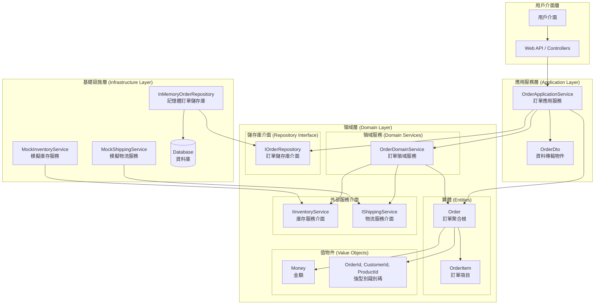
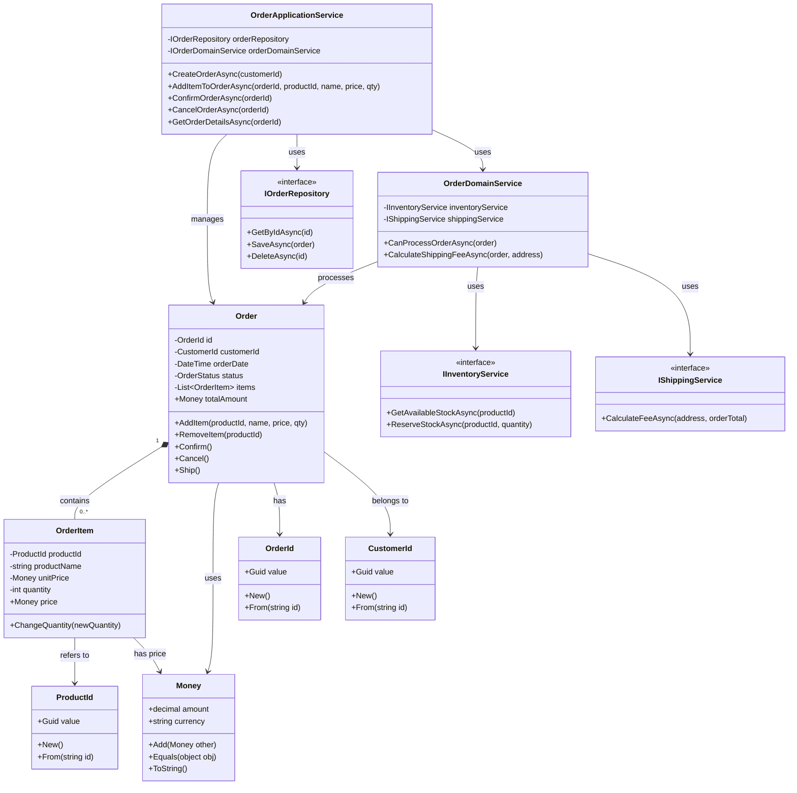
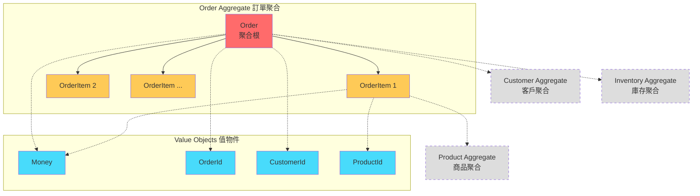
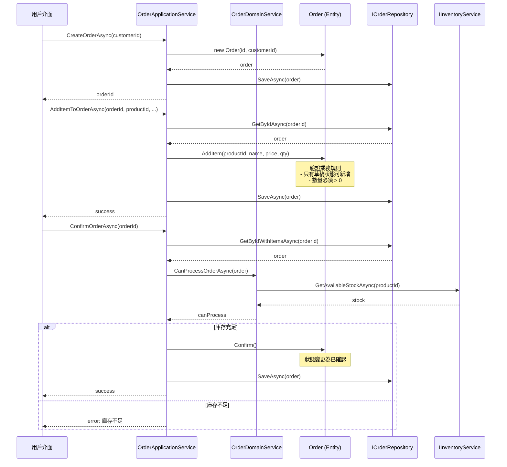
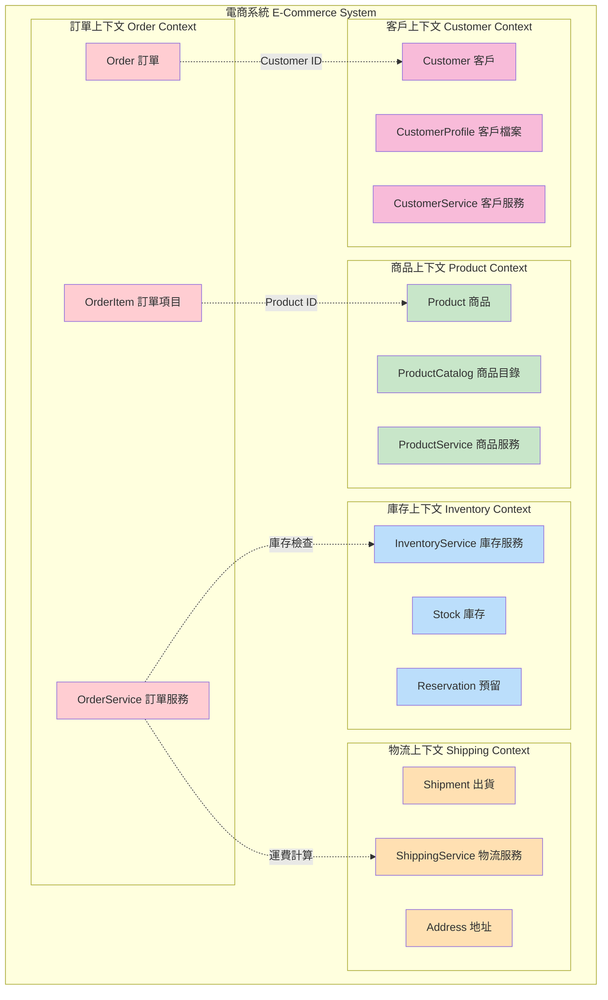

# DDD 架構圖 - 電商訂單系統

## 1. 整體分層架構

```mermaid
graph TB
    subgraph "用戶介面層"
        UI[用戶介面]
        API[Web API / Controllers]
    end
    
    subgraph "應用服務層 (Application Layer)"
        AS[OrderApplicationService<br/>訂單應用服務]
        DTO[OrderDto<br/>資料傳輸物件]
    end
    
    subgraph "領域層 (Domain Layer)"
        subgraph "實體 (Entities)"
            ORDER[Order<br/>訂單聚合根]
            ITEM[OrderItem<br/>訂單項目]
        end
        
        subgraph "值物件 (Value Objects)"
            MONEY[Money<br/>金額]
            IDS[OrderId, CustomerId, ProductId<br/>強型別識別碼]
        end
        
        subgraph "領域服務 (Domain Services)"
            DS[OrderDomainService<br/>訂單領域服務]
        end
        
        subgraph "儲存庫介面 (Repository Interface)"
            IREPO[IOrderRepository<br/>訂單儲存庫介面]
        end
        
        subgraph "外部服務介面"
            IINV[IInventoryService<br/>庫存服務介面]
            ISHIP[IShippingService<br/>物流服務介面]
        end
    end
    
    subgraph "基礎設施層 (Infrastructure Layer)"
        REPO[InMemoryOrderRepository<br/>記憶體訂單儲存庫]
        INV[MockInventoryService<br/>模擬庫存服務]
        SHIP[MockShippingService<br/>模擬物流服務]
        DB[(Database<br/>資料庫)]
    end
    
    %% 依賴關係
    UI --> API
    API --> AS
    AS --> ORDER
    AS --> DS
    AS --> IREPO
    AS --> DTO
    
    ORDER --> ITEM
    ORDER --> MONEY
    ORDER --> IDS
    
    DS --> IINV
    DS --> ISHIP
    DS --> ORDER
    
    REPO --> IREPO
    INV --> IINV
    SHIP --> ISHIP
    
    REPO --> DB
    
    %% %% 樣式
    %% classDef applicationLayer fill:#e1f5fe
    %% classDef domainLayer fill:#f3e5f5
    %% classDef infrastructureLayer fill:#e8f5e8
    
    %% class AS,DTO applicationLayer
    %% class ORDER,ITEM,MONEY,IDS,DS,IREPO,IINV,ISHIP domainLayer
    %% class REPO,INV,SHIP,DB infrastructureLayer
```

## 2. 領域模型詳細結構

```mermaid
classDiagram
    class Order {
        -OrderId id
        -CustomerId customerId
        -DateTime orderDate
        -OrderStatus status
        -List~OrderItem~ items
        +Money totalAmount
        +AddItem(productId, name, price, qty)
        +RemoveItem(productId)
        +Confirm()
        +Cancel()
        +Ship()
    }
    
    class OrderItem {
        -ProductId productId
        -string productName
        -Money unitPrice
        -int quantity
        +Money price
        +ChangeQuantity(newQuantity)
    }
    
    class Money {
        +decimal amount
        +string currency
        +Add(Money other)
        +Equals(object obj)
        +ToString()
    }
    
    class OrderId {
        +Guid value
        +New()
        +From(string id)
    }
    
    class CustomerId {
        +Guid value
        +New()
        +From(string id)
    }
    
    class ProductId {
        +Guid value
        +New()
        +From(string id)
    }
    
    class OrderApplicationService {
        -IOrderRepository orderRepository
        -IOrderDomainService orderDomainService
        +CreateOrderAsync(customerId)
        +AddItemToOrderAsync(orderId, productId, name, price, qty)
        +ConfirmOrderAsync(orderId)
        +CancelOrderAsync(orderId)
        +GetOrderDetailsAsync(orderId)
    }
    
    class OrderDomainService {
        -IInventoryService inventoryService
        -IShippingService shippingService
        +CanProcessOrderAsync(order)
        +CalculateShippingFeeAsync(order, address)
    }
    
    class IOrderRepository {
        <<interface>>
        +GetByIdAsync(id)
        +SaveAsync(order)
        +DeleteAsync(id)
    }
    
    class IInventoryService {
        <<interface>>
        +GetAvailableStockAsync(productId)
        +ReserveStockAsync(productId, quantity)
    }
    
    class IShippingService {
        <<interface>>
        +CalculateFeeAsync(address, orderTotal)
    }
    
    %% 關係
    Order "1" *-- "0..*" OrderItem : contains
    Order --> Money : uses
    Order --> OrderId : has
    Order --> CustomerId : belongs to
    OrderItem --> ProductId : refers to
    OrderItem --> Money : has price
    
    OrderApplicationService --> Order : manages
    OrderApplicationService --> IOrderRepository : uses
    OrderApplicationService --> OrderDomainService : uses
    
    OrderDomainService --> Order : processes
    OrderDomainService --> IInventoryService : uses
    OrderDomainService --> IShippingService : uses
    
    %% 樣式
    %% classDef entity fill:#ffeb3b
    %% classDef valueObject fill:#4caf50
    %% classDef service fill:#2196f3
    %% classDef repository fill:#ff9800
    
    %% class Order,OrderItem entity
    %% class Money,OrderId,CustomerId,ProductId valueObject
    %% class OrderApplicationService,OrderDomainService service
    %% class IOrderRepository,IInventoryService,IShippingService repository
```

## 3. 聚合邊界圖

```mermaid
graph TD
    subgraph "Order Aggregate 訂單聚合"
        OR[Order<br/>聚合根]
        OI1[OrderItem 1]
        OI2[OrderItem 2]
        OI3[OrderItem ...]
        
        OR --> OI1
        OR --> OI2
        OR --> OI3
        
        style OR fill:#ff6b6b
        style OI1 fill:#feca57
        style OI2 fill:#feca57
        style OI3 fill:#feca57
    end
    
    subgraph "Value Objects 值物件"
        M[Money]
        OID[OrderId]
        CID[CustomerId]
        PID[ProductId]
        
        style M fill:#48dbfb
        style OID fill:#48dbfb
        style CID fill:#48dbfb
        style PID fill:#48dbfb
    end
    
    OR -.-> M
    OR -.-> OID
    OR -.-> CID
    OI1 -.-> PID
    OI1 -.-> M
    
    %% 外部聚合參照
    EXT1[Customer Aggregate<br/>客戶聚合]
    EXT2[Product Aggregate<br/>商品聚合]
    EXT3[Inventory Aggregate<br/>庫存聚合]
    
    OR -.-> EXT1
    OI1 -.-> EXT2
    OR -.-> EXT3
    
    style EXT1 fill:#ddd,stroke-dasharray: 5 5
    style EXT2 fill:#ddd,stroke-dasharray: 5 5
    style EXT3 fill:#ddd,stroke-dasharray: 5 5
```

## 4. 資料流程圖

```mermaid
sequenceDiagram
    participant UI as 用戶介面
    participant APP as OrderApplicationService
    participant DOM as OrderDomainService
    participant ENT as Order (Entity)
    participant REPO as IOrderRepository
    participant INV as IInventoryService
    
    UI->>APP: CreateOrderAsync(customerId)
    APP->>ENT: new Order(id, customerId)
    ENT-->>APP: order
    APP->>REPO: SaveAsync(order)
    APP-->>UI: orderId
    
    UI->>APP: AddItemToOrderAsync(orderId, productId, ...)
    APP->>REPO: GetByIdAsync(orderId)
    REPO-->>APP: order
    APP->>ENT: AddItem(productId, name, price, qty)
    Note over ENT: 驗證業務規則<br/>- 只有草稿狀態可新增<br/>- 數量必須 > 0
    APP->>REPO: SaveAsync(order)
    APP-->>UI: success
    
    UI->>APP: ConfirmOrderAsync(orderId)
    APP->>REPO: GetByIdWithItemsAsync(orderId)
    REPO-->>APP: order
    APP->>DOM: CanProcessOrderAsync(order)
    DOM->>INV: GetAvailableStockAsync(productId)
    INV-->>DOM: stock
    DOM-->>APP: canProcess
    
    alt 庫存充足
        APP->>ENT: Confirm()
        Note over ENT: 狀態變更為已確認
        APP->>REPO: SaveAsync(order)
        APP-->>UI: success
    else 庫存不足
        APP-->>UI: error: 庫存不足
    end
```

## 5. 限界上下文圖

```mermaid
graph TB
    subgraph "電商系統 E-Commerce System"
        subgraph "訂單上下文 Order Context"
            O_ORDER[Order 訂單]
            O_ITEM[OrderItem 訂單項目]
            O_SERVICE[OrderService 訂單服務]
        end
        
        subgraph "商品上下文 Product Context"
            P_PRODUCT[Product 商品]
            P_CATALOG[ProductCatalog 商品目錄]
            P_SERVICE[ProductService 商品服務]
        end
        
        subgraph "庫存上下文 Inventory Context"
            I_STOCK[Stock 庫存]
            I_RESERVE[Reservation 預留]
            I_SERVICE[InventoryService 庫存服務]
        end
        
        subgraph "客戶上下文 Customer Context"
            C_CUSTOMER[Customer 客戶]
            C_PROFILE[CustomerProfile 客戶檔案]
            C_SERVICE[CustomerService 客戶服務]
        end
        
        subgraph "物流上下文 Shipping Context"
            S_SHIPMENT[Shipment 出貨]
            S_ADDRESS[Address 地址]
            S_SERVICE[ShippingService 物流服務]
        end
    end
    
    %% 上下文間的關係
    O_ORDER -.->|Customer ID| C_CUSTOMER
    O_ITEM -.->|Product ID| P_PRODUCT
    O_SERVICE -.->|庫存檢查| I_SERVICE
    O_SERVICE -.->|運費計算| S_SERVICE
    
    %% 樣式
    classDef orderContext fill:#ffcdd2
    classDef productContext fill:#c8e6c9
    classDef inventoryContext fill:#bbdefb
    classDef customerContext fill:#f8bbd9
    classDef shippingContext fill:#ffe0b2
    
    class O_ORDER,O_ITEM,O_SERVICE orderContext
    class P_PRODUCT,P_CATALOG,P_SERVICE productContext
    class I_STOCK,I_RESERVE,I_SERVICE inventoryContext
    class C_CUSTOMER,C_PROFILE,C_SERVICE customerContext
    class S_SHIPMENT,S_ADDRESS,S_SERVICE shippingContext
```